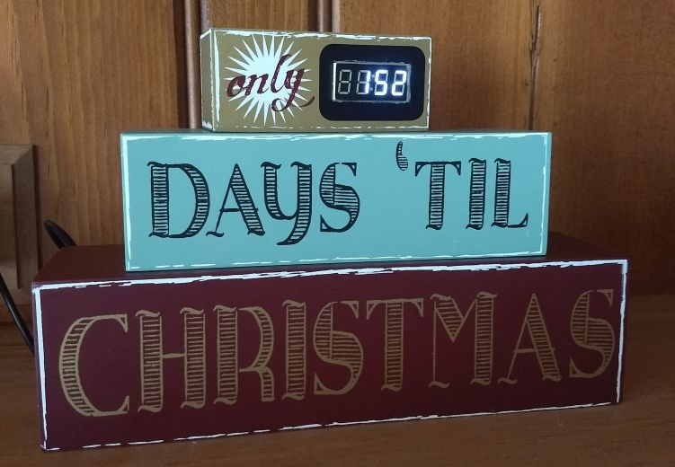
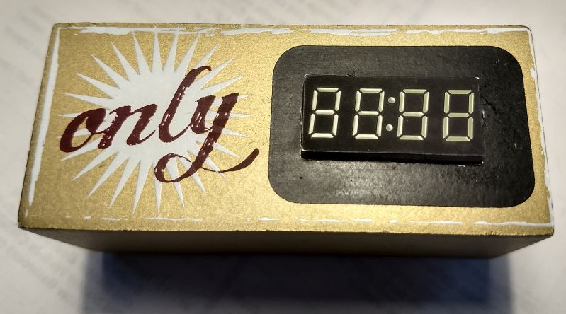
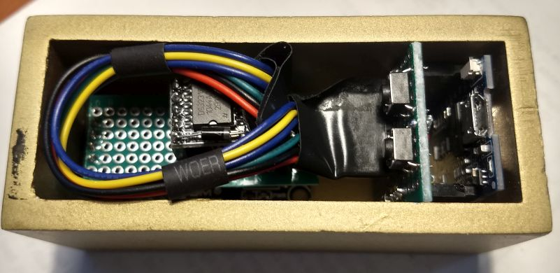
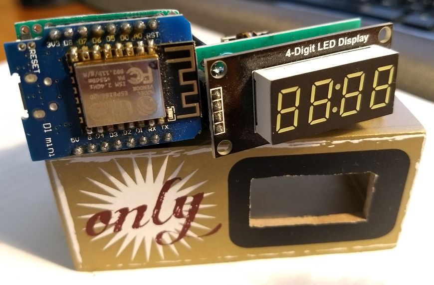
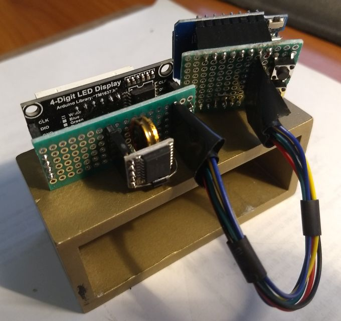

# ChristmasClock

This is a countdown clock that displays the number of days until the next
Christmas:



I found the original item at an estate sale:


At first glance, I thought that it automatically updated the countdown days.
When I discovered that I had to manually update it with chalk, I laughed. This
begged to be automated. I added a microcontroller, a DS3231 RTC, and an LED
display like this:









The hardware and software were derived from the [LedClock](../LedClock) project.

## Hardware Schematic

Here is the rough schematic:

```
                3V3
                / \
                | |
D1Mini          R R
+-------+       | |        DS3231
|       |       | |        +--------+
| SCL/D1|-------+-.--------|SCL     |
| SDA/D2|-------.-+--------|SDA     |
|       |                  +--------+
|       |          
|       |                  TM1637 4-digit
|       |                  7-segment LED
|       |                  +--------+
|    D5 |------------------|CLK     |
|    D7 |------------------|DIO     |
|       |                  +--------+
|    D3 |----S1---+
|    D4 |----S2---+
+-------+         |
                  |
                 GND

R = 10k Ohms
S1, S2 = momentary buttons
```

My TM1637 LED module included 10k pull-up resistors for the CLK and DIO lines,
so I did not add external ones.

## Software

### Installation

Clone this repository:
https://github.com/bxparks/clocks

Install the following dependent libraries, either from the Arduino Library
Manager or cloning directly from the GitHub repo:

* AceButton (https://github.com/bxparks/AceButton)
* AceCRC (https://github.com/bxparks/AceCRC)
* AceCommon (https://github.com/bxparks/AceCommon)
* AceRoutine (https://github.com/bxparks/AceRoutine)
* AceSegment (https://github.com/bxparks/AceSegment)
* AceSegmentWriter (https://github.com/bxparks/AceSegmentWriter)
* AceSorting (https://github.com/bxparks/AceSorting)
* AceTMI (https://github.com/bxparks/AceTMI)
* AceTime (https://github.com/bxparks/AceTime)
* AceTimeClock (https://github.com/bxparks/AceTimeClock)
* AceUtils (https://github.com/bxparks/AceUtils)
* AceWire (https://github.com/bxparks/AceTMI)

### Configuration

Most of the options (various pins and timing parameters) are defined in
`config.h`. Some are defined in `ChristmasClock.ino`.

If you are using the Arduino IDE (as most people probably are), the
configuration parameters are inside the following section in `config.h`:

```C++
[...]
#elif ! defined(AUNITER)
  #warning Arduino IDE detected. Check config parameters.

  #define BUTTON_TYPE BUTTON_TYPE_DIGITAL
  #define MODE_BUTTON_PIN D3
  #define CHANGE_BUTTON_PIN D4
  [...]
#elif
```

If using [AUniter](https://github.com/bxparks/AUniter), the configuration
parameters are defined in the `AUNITER_CHRISTMAS_CLOCK` section in `config.h`.
The `auniter.ini` file used by AUniter should contain something like the
following:

```
[boards]
  d1mini = esp8266:esp8266:d1_mini:xtal=80,vt=flash,exception=disabled,ssl=all,eesz=4M2M,ip=lm2f,dbg=Disabled,lvl=None____,wipe=none,baud=921600

[env:christmasclock]
  board = d1mini
  preprocessor = -D AUNITER_CHRISTMAS_CLOCK
```

Set the `TIME_ZONE_TYPE` parameter in `config.h` to one of the following:

```C++
#define TIME_ZONE_TYPE TIME_ZONE_TYPE_BASIC
#define TIME_ZONE_TYPE TIME_ZONE_TYPE_EXTENDED
```

The UTC offset and the DST shift rules will be automatically calculated from the
TZ Database using the AceTime library. (The `TIME_ZONE_TYPE_MANUAL` is carried
over from the LedClock project, but this functionality is not supported in
ChristmasClock.)

The menu of timezone choices are defined in `ChristmasClock.ino`:

```C++
  &zonedb::kZoneAmerica_Los_Angeles,
  &zonedb::kZoneAmerica_Denver,
  &zonedb::kZoneAmerica_Chicago,
  &zonedb::kZoneAmerica_New_York,
```

### Compiling

If using the Arduino IDE, compile and upload the software in the usual way.

If using AUniter, use the following commands:

```
$ auniter verify christmasclock
$ auniter upload christmasclock:USB0
```

## User Guide

Once the program is uploaded and running, 2 buttons are used to set the clock:

* `Mode`
* `Change`

Clicking on the `Mode` button cycles through various display modes:

* Countdown Days: Number of days until the next Christmas.
* Hour/Minute
* Seconds
* Year
* Month
* Day
* Day of Week
* TimeZone (PST, MST, CST, EST)
* LED Brightness: 0 to 7

The `Change` button is used only in Edit mode to change the values of various
date, time and time zone fields.

### Setting the Date and Time

1. Press on the `Mode` button until the date and time are shown.
1. Press-and-Hold the `Mode` button to enter Edit mode.
    * The **year** field will start to blink.
    * Release the `Mode` button.
    * Press the `Change` button to increment the year by one.
    * When the year goes to 2099, it will cycle back to 2000.
    * Press-and-Hold the `Change` button to rapidly increase the year.
    * Release the `Change` button to stop the automatic increment of the year.
1. When the desired year is set, press the `Mode` button.
    * The **month** will start to blink.
    * Press the `Change` button to increment the month by one.
    * When the month goes to 12, it will cycle back to 1.
    * Press-and-Hold the `Change` button to rapidly increase the month.
    * Release the `Change` button to stop the automatic increment of the month.
1. When the desired month is set, press the `Mode` button.
    * The **day** will start to blink.
    * Use the `Change` button to set the **day**.
1. When the desired day is set, press the `Mode` button.
    * The **hour** will start to blink.
    * Press the `Change` button to set the hour.
1. When the desired hour is set, press the `Mode` button.
    * The **minute** will start to blink.
    * Press the `Change` button to set the minute.
1. When all the date and time fields are set to the desired values,
1. Press-and-Hold the `Mode` button to save the new values. The display should
   no longer blink.

### Setting the Time Zone (Basic and Extended TimeZone Type)

The time zone can be selected from a menu of choices using the buttons on the
clock:

1. Press the `Mode` button until the timezone is shown (`PST`, `MST`, `CST`,
   or `EST`).
1. Press-and-Hold the `Mode` button until the display starts blinking.
1. Press the `Change` button to cycle through the time zones.
1. Press-and-Hold the `Mode` button to save the new timezone. The display should
   no longer blink.

### Setting the LED Brightness

The LED brightness can also be configured at runtime:

1. Press the `Mode` button until the `br: N` screen is shown. The `N` brightness
   value will be between `0` and `7`.
1. Press-and-Hold the `Mode` button until the `N` starts blinking.
1. Press the `Change` button to increment the brightness value.
1. Press-and-Hold the `Mode` button to save the new setting. The display should
   no longer blink.

### Persistence

The LED brightness and timezone settings are preserved in EEPROM and restored
upon reboot.

The date and time values are maintained by the DS3231 RTC module. Some DS3231
modules contain a backup battery to maintain timekeeping without power. This
works well until the battery dies. I added a 0.22F super-capacitor instead which
is sufficient to retain the timekeeping function for a few days without power.
