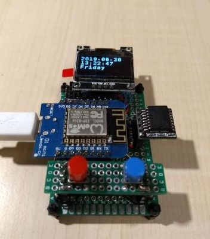
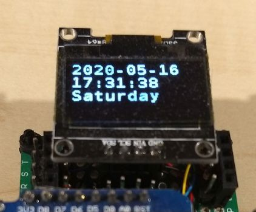
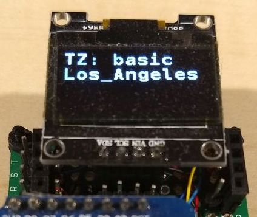
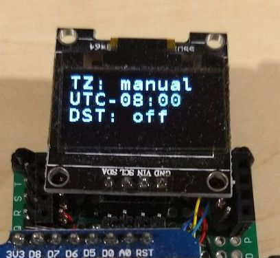
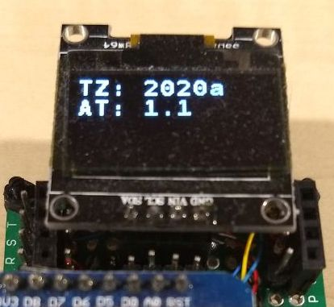

# OledClock

This is spartan digital clock that supports multiple time zones using the
AceTime library. It is intentinoally kept basic so that it can be used for
testing purposes. I use it to test both software (e.g. AceTime, AceButton
libraries), and hardware configurations (Pro Micro, D1 Mini, etc).

Originally, this program supported only the SSD1306 OLED display, but was
extended to support a PCD8544 LCD display while creating the `WorldClockLcd`
program. Substantial parts of the `WorldClockLcd` code have been backported into
this program for flexibility and consistency.

The hardware is assumed to have something like the following

* (1) an Arduino MCU (e.g Nano, Pro Micro, ESP8266, or ESP32)
* digital display, one of the following:
    * (1) 128x64 SSD1306 OLED display (I2C)
    * (1) 84x48 PCD8544 LCD display (SPI)
* (1) DS3231 RTC chip on I2C
* (2) buttons, with 2 configuration choices:
    * using 2 GPIO digital pins (using `ButtonConfig`)
    * using 1 analog pin through a resister ladder (using `LadderButtonConfig`)

The TimeZone can be selected by the user using the buttons. The menu of TimeZone
choices is defined at compile-time, and is limited only by the available memory
of the microcontroller.

## Schematic

### OLED Display on I2C

Here is the rough schematic of a configuration using OLED display on I2C:
```
            5V or 3V3
              / \
              | |
MCU           R R
+-----+       | |        DS3231
|     |       | |        +--------+
|  SCL|-------+-.--------|SCL     |
|  SDA|-------.-+--------|SDA     |
|     |       | |        +--------+
|     |       | |
|     |       | |        OLED (I2C)
|     |       | |        +--------+
|     |       +-.--------|SCL     |
|     |         +--------|SDA     |
|     |                  +--------+
|  D02|----S1---+
|  D03|----S2---+
+-----+         |
                |
               GND

R = 10k Ohms
S1, S2 = momentary buttons
D02, D03 = GPIO pins, could be assigned to some other pins
SCL, SDA = I2C pins
```

### LCD Display on SPI

Here is a rough schematic of the LCD Display on SPI. I often use a WeMos D1 Mini
board which has a limited number of GPIO pins. Once the DS3231 and the LCD
display are hooked up, there are no more pins available for the 2 buttons. I am
forced to use the single analog `A0` pin to handle the 2 buttons.

```
              3V3
              / \
              | |
D1Mini        R R
+-----+       | |        DS3231 (I2C)
|     |       | |        +--------+
|  SCL|-------+-.--------|SCL     |
|  SDA|-------.-+--------|SDA     |
|     |                  +--------+
|     |
|     |                  LCD (SPI)
|     |                  +--------+
| MOSI|------------------|Din     |
| SCLK|------------------|CLK     |
|   SS|------------------|CE      |
|   D4|------------------|D/C     |
|   D3|------------------|LIT     |
|  RST|------------------|RST     |
|     |                  +--------+
|     |         3V3
|     |          |
|     |          R
|     |         / \
|   A0|---------+-+
+-----+         | |
               R1 R2
                | |
               S1 S2
                | |
                \ /
                GND

R = 10k Ohms
R1 = 470 Ohm
R2 = 10k Ohm
S1, S2 = momentary buttons
```

## Photo



## Configuation and Compiling

You probably need to set various parameters in `config.h` match the hardware
that you assembled. The 2 important parameters are:

* `TIME_ZONE_TYPE`: selects the TimeZone algorithm
* `TIME_SOURCE_TYPE`: defines the reference accurate time source
    * `TIME_SOURCE_TYPE_NONE`: use the internal clock
    * `TIME_SOURCE_TYPE_DS3231`: use a DS3231 RTC chip
    * `TIME_SOURCE_TYPE_NTP`: use an NTP server (ESP8266 or ESP32)
    * `TIME_SOURCE_TYPE_BOTH`: use an NPT server as the reference clock, but
      use the DS3231 RTC as backup when the power goes out

If you are using the Arduino IDE (as most people probably are), the
configuration parameters inside the following are the ones you need to change:

```C++
#ifndef AUNITER
  // Arduino IDE in interactive mode
  #define MODE_BUTTON_PIN 2
  #define CHANGE_BUTTON_PIN 3
  #define TIME_SOURCE_TYPE TIME_SOURCE_TYPE_DS3231
  #define OLED_REMAP false
```

All the other ones are the parameters needed by my various boards, so you can
ignore those. The various `AUNITER_xxx` symbols are defined by the
[AUniter](https://github.com/bxparks/AUniter) script, which is the tool that I
normally use for compiling and uploading. You do *not* need to use AUniter, you
can use just the normal Arduino IDE.

## Installations

The following libraries are required:

* AceTime (https://github.com/bxparks/AceTime)
* AceButton (https://github.com/bxparks/AceButton)
* AceRoutine (https://github.com/bxparks/AceRoutine)
* AceCommon (https://github.com/bxparks/AceCommon)
* AceUtils (https://github.com/bxparks/AceUtils)
* AceCRC (https://github.com/bxparks/AceCRC)
* SSD1306Ascii (https://github.com/greiman/SSD1306Ascii)

## User Guide

Once the program is uploaded and running, here is how to set and operate the
OledClock. The 2 buttons are called:

* `Mode`
* `Change`

Clicking on the `Mode` button cycles through the 3 main display modes:

* Date/Time
    * Shows the date, time, and day of week fields.
* TimeZone
    * Shows the current selected Time Zone
* Version
    * Shows the version number of this application and the TZ Database version
      number which was used to generate the TimeZone information.

The `Change` button is used only in Edit mode to change the values of various
date, time and time zone fields.

### Setting the Date and Time

1. Click on the `Mode` button until the date and time are shown.
1. Press-and-Hold the `Mode` button to enter Edit mode.
    * The **year** field will start to blink.
    * Release the `Mode` button.
    * Click the `Change` button to increment the year by one.
    * When the year goes to 2099, it will cycle back to 2000.
    * Press-and-Hold the `Change` button to rapidly increase the year.
    * Release the `Change` button to stop the automatic increment of the year.
1. When the desired year is set, press the `Mode` button.
    * The **month** will start to blink.
    * Click the `Change` button to increment the month by one.
    * When the month goes to 12, it will cycle back to 1.
    * Press-and-Hold the `Change` button to rapidly increase the month.
    * Release the `Change` button to stop the automatic increment of the month.
1. When the desired month is set, press the `Mode` button.
    * The **day** will start to blink.
    * Use the `Change` button to set the **day**.
1. When the desired day is set, press the `Mode` button.
    * The **hour** will start to blink.
    * Use the `Change` button to set the hour.
1. When the desired hour is set, press the `Mode` button.
    * The **minute** will start to blink.
    * Use the `Change` button to set the minute.
1. When all the date and time fields are set to the desired values,
1. Press-and-Hold the `Mode` button to stop the blinking.
    * This will exit the blinking Edit mode.



### Setting the Time Zone (Basic and Extended TimeZone Type)

If `TIME_ZONE_TYPE` is set to either one of the following in `config.h`:

```C++
#define TIME_ZONE_TYPE TIME_ZONE_TYPE_BASIC
#define TIME_ZONE_TYPE TIME_ZONE_TYPE_EXTENDED
```

the UTC offset and the DST shift rules are automatically calculated
from the TZ Database.

The time zone can be selected using the buttons on the clock from a menu of
choices which are compiled into the program as defined by the
`Controller::kZoneRegistry` in `Controller.cpp`:

```C++
  &zonedb::kZoneAmerica_Los_Angeles,
  &zonedb::kZoneAmerica_Denver,
  &zonedb::kZoneAmerica_Chicago,
  &zonedb::kZoneAmerica_New_York,
```

The menu of choices can be changed at compile-time. The number of available time
zones will often be limited by the amount of flash memory in the microcontroller
that you are using.

1. Click on the `Mode` button until the TimeZone display is shown.
1. Press-and-Hold the `Mode` button to enter Edit mode.
    * The **Zone Name** field will start blinking.
1. Click on the `Change` button to cycle through one of the following choices:
    * `Los_Angeles`
    * `Denver`
    * `Chicago`
    * `New_York`
1. When the desired zone is reached, Press-and-Hold the `Mode` button to stop
  the blinking.
    * This will exit the blinking Edit mode.



### Setting the UTC Offset (Manual TimeZone Type)

If `TIME_ZONE_TYPE` is set using the following in `config.h`:

```C++
#define TYPE_ZONE_TYPE TIME_ZONE_TYPE_MANUAL
```

the time zone determined by a fixed offset from UTC and a DST (on/off) flag,
instead of using the TZ Database rules. The following parameters can be
set using the buttons on the clock:

* UTC Offset (e.g. `-08:00`)
* isDst flag (`on` if DST is active, `off` otherwise)

1. Click on the `Mode` button until the TimeZone display is shown.
1. Press-and-Hold the `Mode` button to enter Edit mode.
    * The **UTC** offset will start blinking.
    * Click on the `Change` button to change the UTC offset in 15 minutes
      increments.
    * When you reach `UTC+16:00`, the UTC offset will cycle back to `UTC-16:00`
      and then continue increasing in 15-minute increments.
    * Press-and-Hold the `Change` button to rapidly change the UTC offset.
1. When the desired UTC offset is set, press the `Mode` button.
    * The **DST** on/off setting will start blinking.
    * Click on the `Change` button to toggle the settings between **on** and
    * **off**.
1. When the desired on/off settings is reached, Press-and-Hold the `Mode` button
  to exit the Edit mode.



### Version

There are 2 version numbers shown:

* TZ: The TZ Database version number (e.g. `2020a`)
* AT: The AceTime library version number (e.g. `1.1`)

These fields cannot be editted, so Press-and-Hold on the `Mode` button will
do nothing.



### Persistance

The date and time are stored on the DS3231 RTC. The chip that I am using has a
long-life supercapacitor. It seems to be able to hold enough charge to keep the
RTC running for 3-6 months. After the charge runs out, the date and time will be
reset to some early date (e.g. 1999-12-31 16:00:00).

The time zone (e.g. `Los_Angeles` or `UTC-08:00`) is stored in the EEPROM of the
microcontroller. It will be read back when the power is restored.

When the clock info is read from the EEPROM upon rebooting, the program performs
a CRC32 data integrity check on the information to make sure that it has not
been corrupted. If the CRC32 check fails, then the program *should* set the
various options to the factory default state (e.g. `Los_Angeles` time zone).
However it is possible that something could go wrong with this data integrity
check (or there is a bug in my program).

### Factory Reset

If the EEPROM state becomes corrupted, or the CRC32 check fails, or there
is a bug in my code, it is possible to do a factory reset using the following
compile-time option in `config.h`:

```C++
#define FORCE_INITIALIZE 1
```

Recompile and upload the program to the microcontroller. This should reset
all values to their factory defaults. Afterwards, set the `FORCE_INITIALIZE` to
`0` again, and upload the program again to get the normal behavior.
